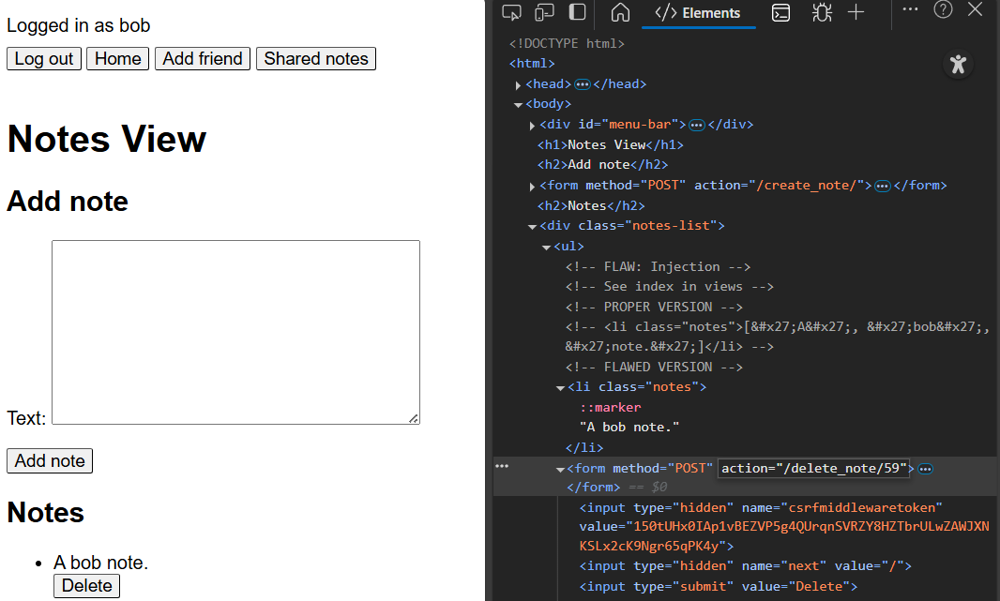
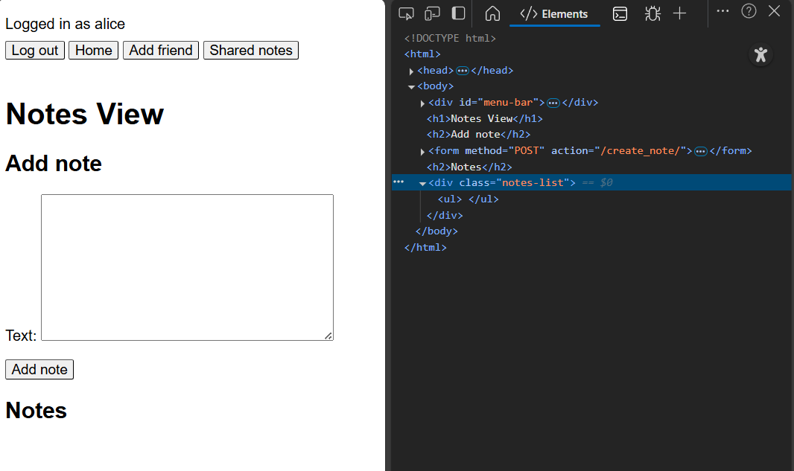
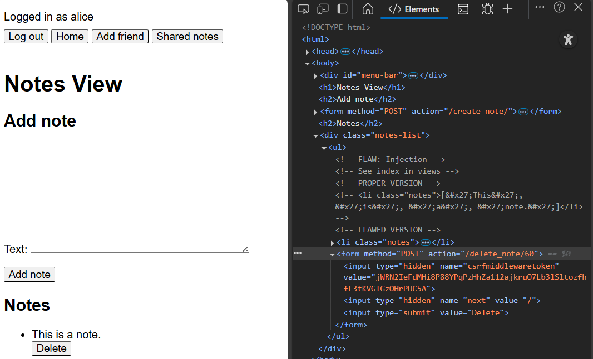
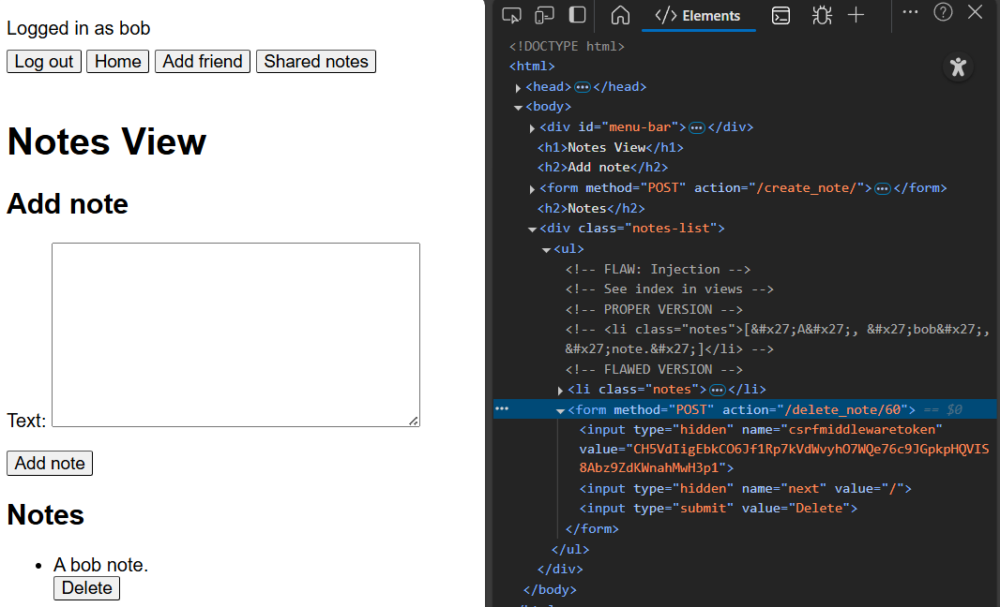
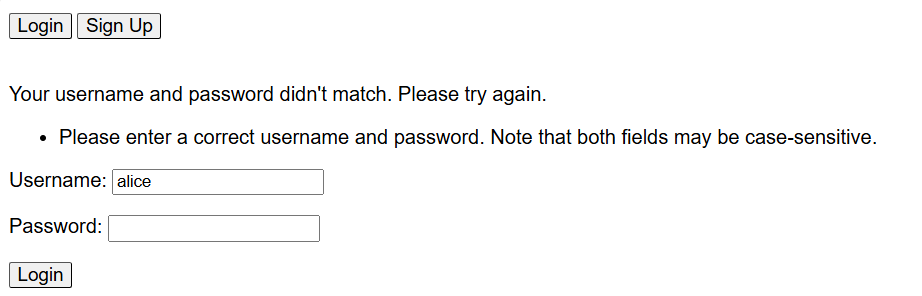

# Cyber security project 1

See https://cybersecuritybase.mooc.fi/module-3.1.

The project is meant to contain at least five different flaws
from the [OWASP top ten list](https://owasp.org/Top10/) of cyber
security flaws, with a fix included for each. The project will use the 2021 list for these
flaws. The flaws are as follows:

1. [Broken access control](https://owasp.org/Top10/A01_2021-Broken_Access_Control/)
    - "Access control enforces policy such that users cannot act outside of their intended permissions."
    For example, one user is able to access another's sensitive information
    by directly navigating to a URL which is otherwise simply not
    shown to the unauthorised user. As a fix, The operation used
    to fetch the information should require authentication and authorisation
    checks.
2. [Cryptographic failures](https://owasp.org/Top10/A02_2021-Cryptographic_Failures/)
    - In general, any sensitive data should be properly secured using
    strong cryptographic algorithms. One issue could be using a pseudo-random
    number generation algorithm that is not cryptographically secure
    for tasks that require said security.
3. [Injection](https://owasp.org/Top10/A03_2021-Injection/)
    - In general, data/input from untrusted sources is not properly
    validated/escaped, allowing the untrusted sources to, for example,
    execute code on the backend that they should not be able to
    by "injecting" instructions. A classic example is SQL injection,
    where input can be specially crafted to escape the intended backend
    SQL query, and perform a new query of the user's choosing. This may potentially
    allow unfettered access to the service's database, and therefore
    access to sensitive data.
4. [Insecure Design](https://owasp.org/Top10/A04_2021-Insecure_Design/)
    - Conceptually more abstract, deals with simply including security considerations
    more in the process of designing a piece of software and
    its overall lifecycle.
5. [Security Misconfiguration](https://owasp.org/Top10/A05_2021-Security_Misconfiguration/)
    - Proper configuration of the environment is lacking. One
    example might be to use development settings in production, such
    as a debug option, which may give away important information about
    the workings of the software.
6. [Vulnerable and Outdated Components](https://owasp.org/Top10/A06_2021-Vulnerable_and_Outdated_Components/)
    - Fairly self-explanatory. For example, using a version of a library
    for which a vulnerability has been found when there is a patched
    version available. Naturally, this would leave the software
    vulnerable to the vulnerability.
7. [Identification and Authentication Failures](https://owasp.org/Top10/A07_2021-Identification_and_Authentication_Failures/)
    - Concerns the improper use of session IDs/tokens and insufficient
    authentication measures. For example, allowing a very short and simple
    password. This makes it easier for malicious actors to gain access
    to sensitive details. 
8. [Software and Data Integrity Failures](https://owasp.org/Top10/A08_2021-Software_and_Data_Integrity_Failures/)
    - Concerns lacking checks for whether software and data is trustworthy.
    For example, not signing and checking signatures of downloaded software (and in
    some cases data), or getting software from untrusted sources. This
    might lead to infected libraries being included, potentially allowing malicious
    actors access to the software and perhaps more.
9. [Security Logging and Monitoring Failures](https://owasp.org/Top10/A09_2021-Security_Logging_and_Monitoring_Failures/)
    - Concerns insufficient logging of events and alerting about suspicious
    activity. For example, any sign-ins, failed or not, should be logged
    so that activity can be tracked. Especially failed sign-ins could
    be a sign of an attempt to gain illicit access to someone's account,
    perhaps by way of a brute-force attack. In this case, logs might include details
    such as IP addresses, allowing some form of identification of the malicious
    actor. In turn, logs would reveal the username of the account, allowing
    possibly for the actual user to be notified through their email,
    possibly suggesting a change of password.
10. [Server-Side Request Forgery (SSRF)](https://owasp.org/Top10/A10_2021-Server-Side_Request_Forgery_%28SSRF%29/)
    - Effectively a sub-category of "Injection", SSRF can happen
    when a user is allowed to input a URL, and that URL is not
    checked for validity but is used to fetch content. This allows
    an attacker to make a request to any address from inside the server,
    such as potentially the file system of the environment the system
    is running on, allowing access to files on the system.

## Flaws

The following parts describe the flaws implemented and fixed, including
images showing the frontend behaviour before and after the fix where possible.
See the comments of the flaws in the code for extra information in addition
to the descriptions below.

Because the code is illustrative more than anything,
there are certainly other flaws in the code, and the code(base) is generally
not altogether well structured. There is no guarantee that
all the below flaws are fixed everywhere in the code. In particular,
the injection flaw described below is not fixed in the shared notes
view due as described.

### Flaw 1: Injection

[local link](./app/app/views.py#L68)

A naive implementation of "url-ization" is used to find URLs in users'
text using a Django URL validator, and links (\<a\> tags) are created
based on the found URLs. In order to show the parts as links, the resultant
url strings are incorrectly marked as safe. As a result, text like
https://example.com/\<script\>console.log("xss_attack")\<\\script\>/some-path
is considered to be a valid URL, and as it is set in an \<a\> tag and marked
as safe, on rendering the text, the script is executed. In the app,
a user can create such a text, which can be loaded in another user's
"shared" view, allowing an XSS attack to take place.

This is fixed by using the Django template filter "urlize" instead, which
does the job properly. Or, it at least avoids problems like the above;
it is not entirely clear from documentation whether urlize is completely safe in
this regard, but based on the documentation and source code, the resultant
value should be HTML safe. Some amount of testing has not revealed an injection
flaw either.

Note that only the Notes adding view has the fix, while the Shared notes view
does not. This is for ease of testing, as there are fewer places where
code needs to be commented in/out, and it's easier to test where the notes
can actually be added anyway.

#### Before fix

Add a note with a URL that contains a script block:

Look at alice's note in bob's view:

#### After fix

### Flaw 2: Broken Access Control

[local link](./app/app/views.py#L159)

The ability to delete a note is available. The view requires login,
but does not ensure that the note being deleted is one made by the
logged in user. This allows a user who is logged in to delete
notes that are not theirs by passing a different id in the post
request.

The fix is simple, as the only change is to require that the note
that is fetched under the given id is also one that is associated
with the logged in user. If this is not the case, the view returns
a 404 instead of 403 to not divulge information about whether
notes exist with a given id.

#### Before fix

Alice's note has the ID 59. (On a side note, the template has an issue
too: part of it is commented out with HTML comment syntax, but Django
still inputs its data, which is shown to the user. In practice, the Django comment template
tag should be used.)

Bob's note has the ID 50.

Bob changes the ID in the HTML to 59 (and presses delete on their
note):

In alice's view, alice's note has been deleted:

#### After fix

Another alice note has the ID 60:

Bob changes the ID in their view to 60 again:

Bob is not successful in deleting alice's note this time. A 404 is returned
instead of a 403 so that user's cannot test whether a note with a given
ID exists.

### Flaw 3: Security Logging and Monitoring Failures

[local link](./app/app/views.py#L357)

The flawed login view does not log login attempts. Logging these
attempts is useful to be able to potentially track malicious attempts
to log into someone's account.

In the fixed version, login attempts are logged and include the used username
and the IP of the request. This could allow tracking brute force cracking attempts
made from a given IP to a given username.

There may well be other places in the code which could use more logging,
such as the logout view, but the example here illustrates the idea.

#### Before fix

#### After fix

### Flaw 4: Identification and Authentication Failures

[local link](./app/app/views.py#L357)

This is in the same part of code as the previous flaw.

Django already uses the PKDF2 algorithm for passwording hashing which
allows setting a variable computation cost and therefore limit
the efficacy of brute force attacks by slowing the speed at which
passwords can be checked. However, there is nothing to limit
the number of login attempts that can be made, so passwords can
still be tested constantly. A distributed system could still test
passwords at a considerable speed, though perhaps not fast enough
regardless.

As a fix, a simple brute force prevention setup is added to the login
form. The setup caches failed login attempts from an IP. If too many
attempts are made, the next attempts return an error for an amount of time,
with no validation or authentication performed at all. The number of failed attempts
allowed and the cooldown time are configurable. In the example code, the time
is very short to allow better testing.

As well as preventing brute forcing
to an extent, skipping the computationally expensive authentication step
can help to reduce the effect of a distributed denial of service attack.
Indeed, a similar setup could be used to limit the number of any type
of interaction a given IP can make in a given amount of time, with
potentially more complex rules, like increasing the cooldown time
with repeated "offenses". However, these considerations are not part of the
considered flaw.

Of course, in a proper application, There are likely numerous
other features to reduce the efficacy of online brute forcing (attempting to guess
the correct password through continous login attempts). Adding logging
to track login attempts (as is the case in the previous flaw) would allow
tracking suspicious behaviour, possibly banning IPs that attempt logins too
many times. Of course, this is effectively what happens in the example
here already. Further, constant login attempts may cause high usage
on the authentication server which may be noticed, and ideally would be
noticed, by the engineers. Though again, good logging would be necessary
to figure out what's going on. Another feature that can help against
password cracking in this way is multi-factor authentication, such as
confirmation through a phone. While
it doesn't directly disallow the attempts, even if a valid password is
found, it cannot be used without the secondary authentication. The login
attempt would be logged and the true user would be likely alerted to
the hack as a result, allowing the password to be changed. Likewise,
requiring confirmation through a related email when a new IP/machine tries
to login can avoid the problem in part.

#### Before fix

#### After fix

### Flaw 5: Security Misconfiguration

[local link](./app/flawedsite/settings.py#L26)

The default settings that Django generates include the DEBUG variable
set to True and the SECRET_KEY existing within the settings directly.
As mentioned by the settings file itself, the debug should not be used
in production as the error pages show information about the inner workings
of the app, which can give important information to hackers to focus
on certain vulnerabilities they expect to find in a Django application (for
example). Likewise as mentioned by the settings file, the SECRET_KEY should
should be kept secret (shockingly). Obviously any other keys, like database
API keys, should be kept secret too.

The fix is again easy enough: DEBUG is set to False so no informative
error pages are shown (amongst other effects, of course), and SECRET_KEY
is read in from an environment variable. The setting of the environment variable is
simulated here, setting it directly into the environment before fetching
into the key. The environment variable
is also namespaced using a "DJANGO_" prefix to prevent clashes.

As an aside, due to the way Django works, the static files will not
be correctly served while not in debug mode, causing lack of CSS styling,
but this is besides the point here.

#### Before fix

#### After fix